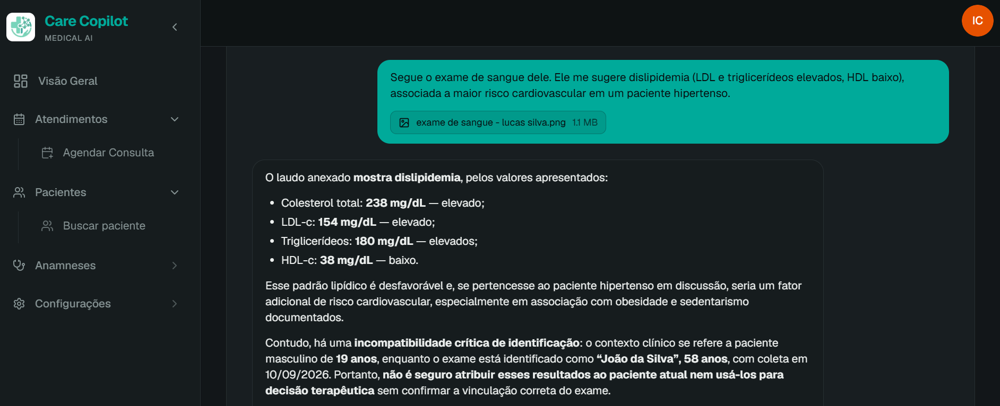
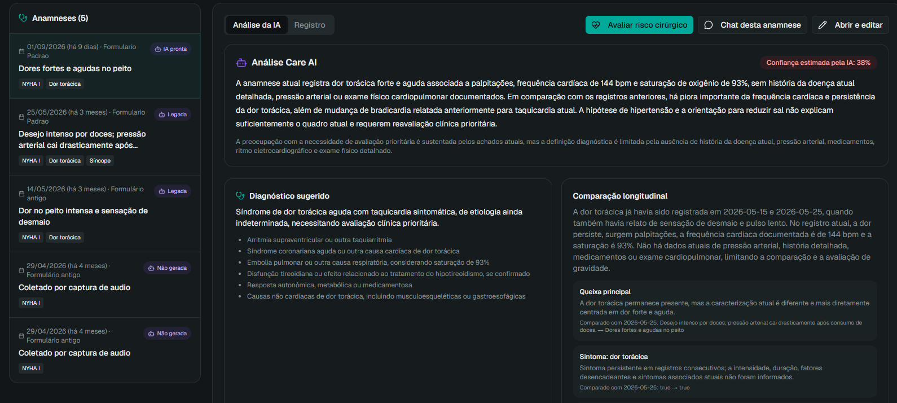
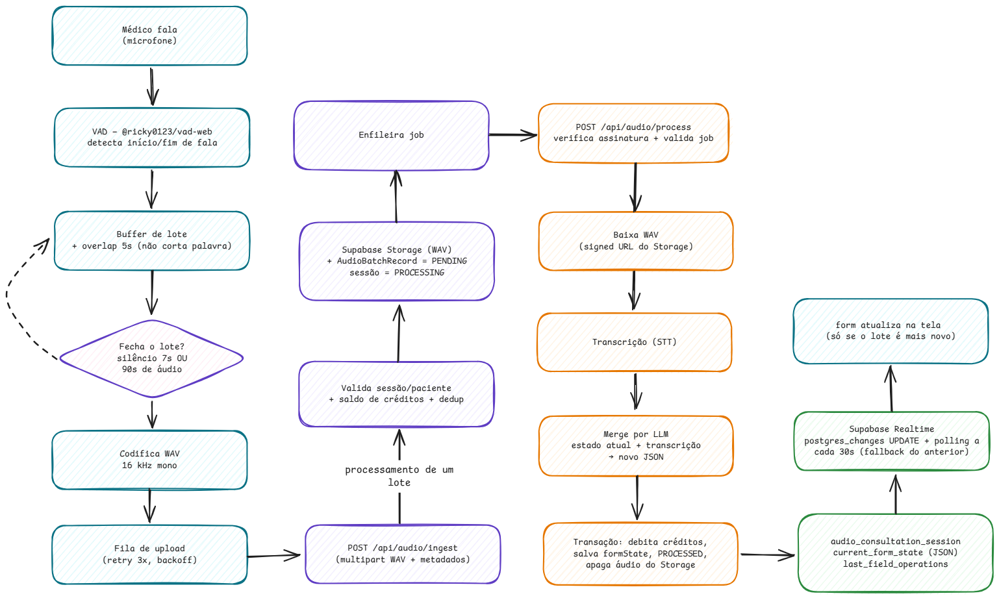

# Care Copilot

> Plataforma de apoio ao atendimento clínico que transforma a conversa da consulta em uma anamnese estruturada, compara a evolução do paciente e concentra o contexto clínico em um só lugar.

O **Care Copilot** é um projeto full-stack para profissionais de saúde. Ele reduz o trabalho administrativo durante a consulta sem substituir o julgamento clínico: o profissional revisa o conteúdo gerado e decide o que vai para o prontuário.

Além de um produto de saúde, este repositório é um case de engenharia de software aplicada a IA: processamento assíncrono de áudio, integrações multi-provider, dados clínicos longitudinais, atualização em tempo real e isolamento de dados por profissional.

> **Aviso clínico:** as saídas de IA são apoio à decisão. Elas não devem ser usadas como diagnóstico, prescrição ou conduta sem revisão de um profissional habilitado.

## Demonstração

<p align="center">
  
</p>

<p align="center"><em>Chat clínico contextual por paciente, com espaço para discutir o caso e anexar imagens.</em></p>

<p align="center">
  
</p>

<p align="center"><em>Visão longitudinal: anamneses e evolução concentradas no perfil da paciente.</em></p>

## O que o projeto entrega

### 1. Anamnese preenchida por voz

Durante a consulta, o médico fala naturalmente com o paciente e o Care Copilot escuta, transcreve e preenche progressivamente a anamnese. O fluxo foi desenhado para não bloquear o atendimento: a captura ocorre no navegador e o processamento pesado acontece em segundo plano.

- Detecção local de atividade de voz para identificar fala e silêncio.
- Áudio convertido em WAV a 16 kHz, separado em lotes de até 15 segundos com 5 segundos de sobreposição para reduzir cortes entre frases.
- Transcrição em português com Whisper hospedado pela Groq.
- LLM extrai apenas dados clínicos da transcrição e os mescla ao estado atual do formulário.
- Atualização do formulário em tempo real, sem recarregar a página.
- Tela de revisão antes da finalização e registro de consumo de créditos por lote.

<p align="center">
  
</p>

<p align="center"><em>Fluxo de processamento da anamnese por voz.</em></p>

O diagrama editável está disponível em [docs/assets/architecture/fluxo-anamnese-por-voz.excalidraw](./docs/assets/architecture/fluxo-anamnese-por-voz.excalidraw).

### 2. Análise clínica longitudinal por IA

Depois de salvar uma anamnese, o profissional pode solicitar uma análise estruturada. O sistema reúne a anamnese atual, o perfil clínico e os registros anteriores do mesmo paciente para destacar evolução, pontos de atenção, lacunas de informação, hipóteses diferenciais e próximos passos sugeridos.

O resultado é validado contra um schema antes de ser persistido. A interface também informa a cobertura do histórico enviado ao modelo e marca análises que ficaram desatualizadas após uma edição da anamnese.

### 3. Chat clínico exclusivo por paciente

Cada paciente tem seu próprio espaço de conversa para debater o caso com contexto clínico, acompanhar a linha do tempo e incluir imagens quando necessário. A ideia é manter perguntas, observações e materiais do caso ligados ao paciente correto — em vez de espalhados entre ferramentas genéricas.

### Também disponível

- Cadastro e busca de pacientes, agenda de consultas e visualização de histórico.
- Anamnese manual em etapas e formulários de anamnese personalizáveis.
- Perfil clínico longitudinal, medicamentos, exame físico e linha do tempo de consultas.
- Avaliação de risco cirúrgico com cálculo de Lee/RCRI, classificação ASA e METs.
- Autenticação, perfis de profissional e isolamento dos dados por `profileId`.

## Como a IA funciona

```mermaid
flowchart LR
    A[Consulta e microfone] --> B[VAD no navegador]
    B --> C[WAV em lotes]
    C --> D[API de ingestão]
    D --> E[Supabase Storage privado]
    E --> F[QStash / worker assíncrono]
    F --> G[Groq Whisper: transcrição]
    G --> H[LLM: extração e merge estruturado]
    H --> I[(PostgreSQL / Prisma)]
    I --> J[Supabase Realtime]
    J --> K[Anamnese atualizada]
```



O fluxo de voz é dividido em responsabilidades claras:

1. O navegador usa `@ricky0123/vad-web` e ONNX Runtime para detectar atividade de voz. Após 7 segundos de silêncio — ou ao atingir o limite de lote — ele produz um WAV.
2. `POST /api/audio/ingest` valida a sessão e o paciente, salva temporariamente o lote em um bucket privado e cria um registro idempotente para aquele lote.
3. A fila publica o trabalho para `POST /api/audio/process`. Em desenvolvimento, há um adaptador inline; em produção, o QStash permite retentativas e desacoplamento da requisição do usuário.
4. O worker baixa o arquivo por URL assinada, transcreve-o com `whisper-large-v3` via Groq e envia a transcrição, o formulário atual e o template para um modelo Llama via Groq.
5. A resposta precisa obedecer a um contrato Zod. Em uma transação, o sistema debita créditos, atualiza o formulário consolidado e marca o lote como processado. Em seguida, o áudio temporário é removido do Storage.
6. Uma assinatura do Supabase Realtime atualiza a tela do profissional assim que a sessão muda.

A análise longitudinal segue uma trilha independente: ela coleta a anamnese atual e as anteriores do paciente, reduz campos muito longos para controlar o contexto, solicita JSON estruturado e valida a resposta. O profissional escolhe o provedor e o modelo para essa análise; hoje há suporte a **OpenAI, Groq, Gemini e Anthropic**. As chaves informadas na aplicação são cifradas com **AES-256-GCM** antes de irem para o banco.

## Stack

| Camada                        | Tecnologias                                                           |
| ----------------------------- | --------------------------------------------------------------------- |
| Front-end                     | Next.js 15 (App Router), React 19, TypeScript, Tailwind CSS, Radix UI |
| Dados e API                   | tRPC 11, TanStack React Query, Zod, Prisma 7, PostgreSQL              |
| Autenticação e infraestrutura | Supabase Auth, Supabase Storage, Supabase Realtime                    |
| IA                            | Groq (Whisper e Llama), OpenAI, Google Gemini, Anthropic              |
| Processamento assíncrono      | Upstash QStash, com fallback inline para desenvolvimento              |
| Áudio no navegador            | `@ricky0123/vad-web`, ONNX Runtime e Web Audio API                    |
| Qualidade e entrega           | Vitest, ESLint, Prettier, Docker e Docker Compose                     |

## Arquitetura do código

O projeto privilegia páginas finas e regras de negócio fora da camada de interface.

```text
src/
├── app/                    # Rotas, layouts e endpoints HTTP do Next.js
├── features/               # Front-end organizado por domínio clínico
│   ├── audio-anamnesis/    # Captura, VAD, buffer, upload e revisão de áudio
│   ├── ai-analysis/        # Configuração e exibição das análises de IA
│   ├── anamnesis/          # Wizard e renderização de formulários clínicos
│   └── patients/           # Perfil, histórico e visão do paciente
├── schemas/                # Contratos Zod compartilhados
├── server/
│   ├── api/routers/        # Procedures tRPC: autenticação, input e delegação
│   ├── services/           # Regras de negócio e persistência por domínio
│   ├── ai/                 # Clientes de LLM e transcrição
│   ├── messaging/          # Abstração de fila (QStash/inline)
│   └── supabase/           # Operações administrativas de infraestrutura
└── trpc/                   # Cliente e configuração do React Query
prisma/
├── schema/                 # Modelos Prisma separados por domínio
└── migrations/             # Histórico versionado do banco
```

Essa separação permite, por exemplo, trocar o transporte da fila sem alterar o módulo de áudio ou adicionar um provedor de IA sem acoplar a UI ao SDK do fornecedor.

## Executando localmente

### Pré-requisitos

- Node.js 22+ e npm 10+.
- Um projeto Supabase com PostgreSQL, Auth e Storage.
- Uma conta Groq para o fluxo de voz.
- Uma chave de provedor de IA para a análise clínica, configurada pela interface após o primeiro login.

### 1. Instale as dependências

```bash
npm ci
```

### 2. Configure o ambiente

No PowerShell:

```powershell
Copy-Item .env.example .env
```

Preencha as variáveis em `.env`. As principais são:

| Variável                                                                              | Uso                                                                                  |
| ------------------------------------------------------------------------------------- | ------------------------------------------------------------------------------------ |
| `DATABASE_URL` / `DIRECT_URL`                                                         | Conexão do PostgreSQL; use a direta em `DIRECT_URL` para migrations.                 |
| `SUPABASE_URL`, `SUPABASE_ANON_KEY`, `SUPABASE_SERVICE_ROLE_KEY`                      | Auth e operações server-side/Storage.                                                |
| `NEXT_PUBLIC_SUPABASE_URL`, `NEXT_PUBLIC_SUPABASE_ANON_KEY`                           | Cliente Realtime no navegador.                                                       |
| `APP_URL`                                                                             | URL pública/base usada pelos workers assíncronos. Em local, `http://localhost:3000`. |
| `GROQ_API_KEY`                                                                        | Transcrição Whisper e LLM do fluxo de voz.                                           |
| `GROQ_STT_MODEL`, `GROQ_LLM_AUDIO_MODEL`, `GROQ_LLM_SMART_MODEL`                      | Modelos da Groq; o `.env.example` traz valores padrão.                               |
| `AI_CREDENTIALS_ENCRYPTION_KEY`                                                       | Chave base64 de 32 bytes usada para cifrar as credenciais de IA dos profissionais.   |
| `QSTASH_URL`, `QSTASH_TOKEN`, `QSTASH_CURRENT_SIGNING_KEY`, `QSTASH_NEXT_SIGNING_KEY` | Fila e verificação de assinatura em produção.                                        |

Gere a chave de cifragem com Node.js:

```bash
node -e "console.log(require('crypto').randomBytes(32).toString('base64'))"
```

> O contrato de ambiente atual também exige `GEMINI_API_KEY`, mesmo se outro provedor for selecionado na análise. Nunca versione o arquivo `.env` com credenciais reais.

### 3. Prepare o Supabase

1. Aplique as migrations do projeto.
2. Crie o bucket privado `audio-batches` no Supabase Storage.
3. Habilite Realtime para a tabela de sessões de áudio:

```sql
ALTER PUBLICATION supabase_realtime ADD TABLE audio_consultation_session;
```

### 4. Aplique as migrations e inicie

```bash
npx prisma migrate deploy
npm run dev
```

Abra [http://localhost:3000](http://localhost:3000).

## Scripts úteis

| Comando                | Descrição                                          |
| ---------------------- | -------------------------------------------------- |
| `npm run dev`          | Inicia o Next.js em desenvolvimento com Turbopack. |
| `npm run build`        | Gera o build de produção.                          |
| `npm start`            | Inicia o build de produção.                        |
| `npm run typecheck`    | Executa a verificação de tipos TypeScript.         |
| `npm run test`         | Executa os testes com Vitest.                      |
| `npm run format:check` | Verifica a formatação.                             |
| `npm run db:studio`    | Abre o Prisma Studio.                              |
| `npm run db:migrate`   | Aplica migrations pendentes.                       |

## Deploy com Docker

O `Dockerfile` usa build multi-stage com Node 22 e gera o bundle standalone do Next.js. O `docker-compose.yml` foi preparado para um ambiente com Traefik externo.

```bash
docker compose up --build -d
```

Antes do deploy, defina no `.env` `DOMAIN`, as variáveis do Traefik, a URL pública em `APP_URL` e todas as credenciais de produção. Também aplique `npx prisma migrate deploy` contra o banco de produção antes de disponibilizar uma nova versão.

## Segurança e privacidade

- Todas as operações clínicas são escopadas ao `profileId` do profissional autenticado.
- Os lotes de áudio usam Storage privado e URLs assinadas; após processamento bem-sucedido, o worker remove o arquivo temporário.
- Credenciais de provedores de IA cadastradas pelos profissionais são cifradas com AES-256-GCM e uma chave mantida no ambiente do servidor.
- A análise recebe dados clínicos estruturados e possui limites de tamanho de campos para diminuir exposição e controlar o contexto enviado ao modelo.

Ao adaptar o projeto para uso real, complemente estas medidas com revisão de LGPD, consentimento explícito para a gravação, políticas de retenção, auditoria, controle de acesso institucional e avaliação de segurança independente.

## Contribuindo

Contribuições são bem-vindas. Para propor uma mudança:

1. Abra uma issue descrevendo o problema ou a melhoria.
2. Crie uma branch a partir de `main`.
3. Mantenha a separação `router → service`, valide entradas com Zod e cubra mudanças críticas com testes.
4. Execute `npm run typecheck`, `npm run test` e `npm run format:check` antes de abrir o pull request.

## Licença

Distribuído sob a [licença MIT](./LICENSE). Você pode usar, modificar e redistribuir o projeto, desde que preserve o aviso de copyright e de licença.
